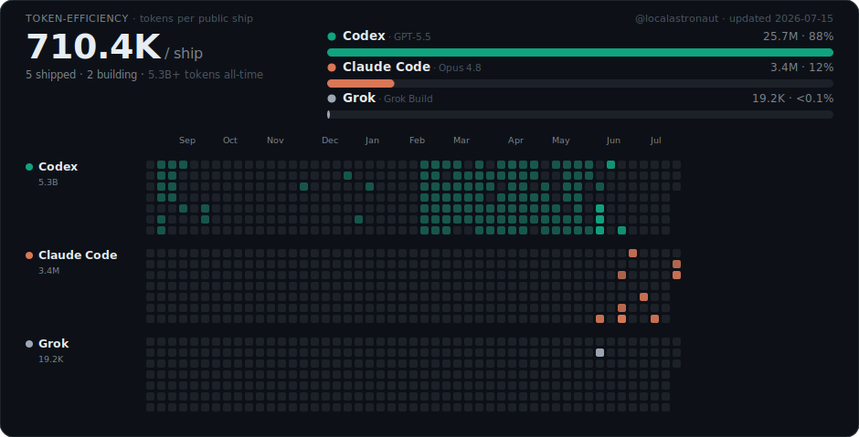

# `@localastronaut`

I build things — and lately a lot *more* of them, because I figured out how to build **with** AI instead of around it.

This page is a little experiment I'm running on myself: my machine keeps a tally of which AI tools I actually reach for when I'm writing code, and redraws the card below automatically. No estimates, no vibes — just the real token counts pulled straight from my own logs.

### why this exists

Friends keep asking me *"okay, but which AI should I actually use?"* — so instead of having opinions, I'm just showing my receipts.

Important caveat: this is **only my coding usage** — Claude Code, Codex, and Grok running in my terminal, measured locally. It says nothing about how I use these apps for everything else. It's purely what I reach for when I'm shipping code.

A few things I've noticed watching my own numbers:

- **The tool that wins isn't the one with the best benchmark** — it's the one that disappears into the work.
- **My output didn't tick up when I leaned into these. It changed shape.** The cumulative line basically only points one direction.
- **The gap between "I have an idea" and "it exists" has never been smaller.** If you've been on the fence, this is your sign — go build something.

### the fine print

- **Two numbers, both honest.** The **5.3B+** badge is lifetime tokens *processed* (includes cache + full history, straight from each tool's own usage screen). The **share split** uses **work tokens** — non-cached input + output, counted identically for every tool — so "what I reach for" is an apples-to-apples comparison.
- Refreshes whenever I push code, plus a daily snapshot. The day-by-day record lives in [`data/token-stats.json`](./data/token-stats.json) — a real time series, not just a snapshot.
- I also make music and films. Different corner of my life; this one's the build log.

↑ <a href="./scripts/generate-token-stats.py">the script</a> reads my local CLI logs and publishes aggregate counts only — never prompts, code, or file names.
